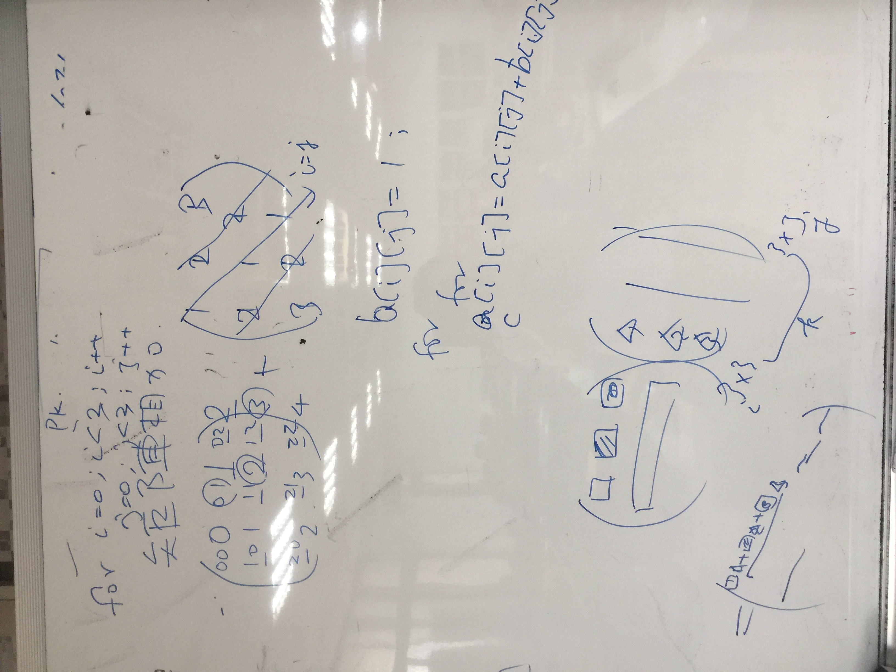

###### exercise1:陣列存取與基本運算
```
把一個陣列元素全部都平方存到另一個陣列
把一個陣列元素全部都反轉存到另一個陣列
改自教科書範例
```

```
#include <iostream>
using namespace std;

int main()
{
  const int NUMBER_OF_ELEMENTS = 2;
  double numbers[NUMBER_OF_ELEMENTS];
  double numbers_squared[NUMBER_OF_ELEMENTS];
  double sum = 0;

  for (int i = 0; i < NUMBER_OF_ELEMENTS; i++)
  {
    cout << "Enter a new number: ";
    cin >> numbers[i];
    sum += numbers[i];
    numbers_squared[i]=numbers[i]*numbers[i];
  }
  cout << "numbers[1] is " << numbers[1] << endl;
  cout << "numbers_squared[1] is " << numbers_squared[1] << endl;
  
  double average = sum / NUMBER_OF_ELEMENTS;

  int count = 0; // The number of elements above average
  for (int i = 0; i < NUMBER_OF_ELEMENTS; i++)
    if (numbers[i] > average)
      count++;

  cout << "Average is " << average << endl;
  cout << "Number of elements above the average " << count << endl;
  system("pause"); 
  return 0;
}


```
```
說明:
numbers_squared[i]=numbers[i]*numbers[i];


```


### exercise2:程式閱讀題

```
#include <iostream>
using namespace std;
int S(int,int);
int main(void)
{
    int i,f[5],x,ans=0;
    for(i=0;i<5;i++) {
      cout<<"請輸入方程式中"<< i <<" 次項的係數";
      cin>>f[i];
    }
    cout<<"請輸入欲計算的變數值";
    cin>>x;
    for(i=0;i<5;i++) {
      ans = ans + S(x,i) * f[i];
    }
    cout<<"f("<<x<<") = "<<ans<<endl;
    return 0; 
}
int S(int x,int n)
{
    int i,tmp=x;
    if(n==0) return 1;
    for(i=1;i<n;i++)
      x = x*tmp;
    return x;  
}

```
### exercise3:矩陣相加與矩陣相乘


關鍵程式技術:自動產生元素的矩陣



關鍵程式技術:矩陣相乘


```


```


```


```
###### exercise1

```


```
###### exercise1

```


```
###### exercise1

```


```
###### exercise1

```


```
###### exercise1

```


```
###### exercise1

```


```
###### exercise1

```


```
###### exercise1

```


```
###### exercise1

```


```
###### exercise1

```


```
###### exercise1

```


```
###### exercise1

```


```
###### exercise1

```


```
###### exercise1

```


```
###### exercise1

```


```
###### exercise1

```


```
###### exercise1

```


```
###### exercise1

```


```
###### exercise1

```


```
###### exercise1

```


```
###### exercise1

```


```
###### exercise1

```


```
###### exercise1

```


```
###### exercise1

```


```
###### exercise1

```


```
###### exercise1

```


```
###### exercise1

```


```
###### exercise1

```


```
###### exercise1

```


```
###### exercise1

```


```
###### exercise1

```


```
###### exercise1

```


```
###### exercise1

```


```
###### exercise1

```


```
###### exercise1

```


```
###### exercise1

```


```
###### exercise1

```


```
###### exercise1

```


```
###### exercise1

```


```
###### exercise1

```


```
###### exercise1

```


```
###### exercise1

```


```
###### exercise1

```


```
###### exercise1

```


```
###### exercise1

```


```
###### exercise1

```


```
###### exercise1

```


```
###### exercise1

```


```
###### exercise1

```


```
###### exercise1

```


```
###### exercise1

```


```
###### exercise1

```


```
###### exercise1

```


```
###### exercise1

```


```
###### exercise1

```


```
###### exercise1

```


```
###### exercise1

```


```
###### exercise1

```


```
###### exercise1

```


```
###### exercise1

```


```
###### exercise1

```


```
###### exercise1

```


```
###### exercise1

```


```
###### exercise1

```


```
###### exercise1

```


```
###### exercise1

```


```
###### exercise1

```


```
###### exercise1

```


```
###### exercise1

```


```
###### exercise1

```


```
###### exercise1

```


```
###### exercise1

```


```
###### exercise1

```


```
###### exercise1

```


```
###### exercise1

```


```
###### exercise1

```


```
###### exercise1

```


```
###### exercise1

```


```
###### exercise1

```


```
###### exercise1

```


```
###### exercise1

```


```
###### exercise1

```


```
###### exercise1

```


```
###### exercise1

```


```
###### exercise1

```


```
###### exercise1

```


```
###### exercise1

```


```
###### exercise1

```


```
###### exercise1

```


```
###### exercise1

```


```
###### exercise1

```


```
###### exercise1

```


```
###### exercise1

```


```
###### exercise1

```


```
###### exercise1

```


```
###### exercise1

```


```
###### exercise1

```


```
###### exercise1

```


```
###### exercise1

```


```
###### exercise1

```


```
###### exercise1

```


```
###### exercise1

```


```
###### exercise1

```


```
###### exercise1

```


```
###### exercise1

```


```
###### exercise1

```


```
###### exercise1

```


```
###### exercise1

```


```
###### exercise1

```


```
###### exercise1

```


```
###### exercise1

```


```
###### exercise1

```


```
###### exercise1

```


```
###### exercise1

```


```
###### exercise1

```


```
###### exercise1

```


```
###### exercise1

```


```
###### exercise1

```


```
###### exercise1

```


```
###### exercise1

```


```
###### exercise1

```


```
###### exercise1

```


```
###### exercise1

```


```
###### exercise1

```


```
###### exercise1

```


```
###### exercise1

```


```
###### exercise1

```


```
###### exercise1

```


```
###### exercise1

```


```
###### exercise1

```


```
###### exercise1

```


```
###### exercise1

```


```
###### exercise1

```


```
###### exercise1

```


```
###### exercise1

```


```
###### exercise1

```


```
###### exercise1

```


```
###### exercise1

```


```
###### exercise1

```


```
###### exercise1

```


```
###### exercise1

```


```
###### exercise1

```


```
###### exercise1

```


```
###### exercise1

```


```
###### exercise1

```


```
